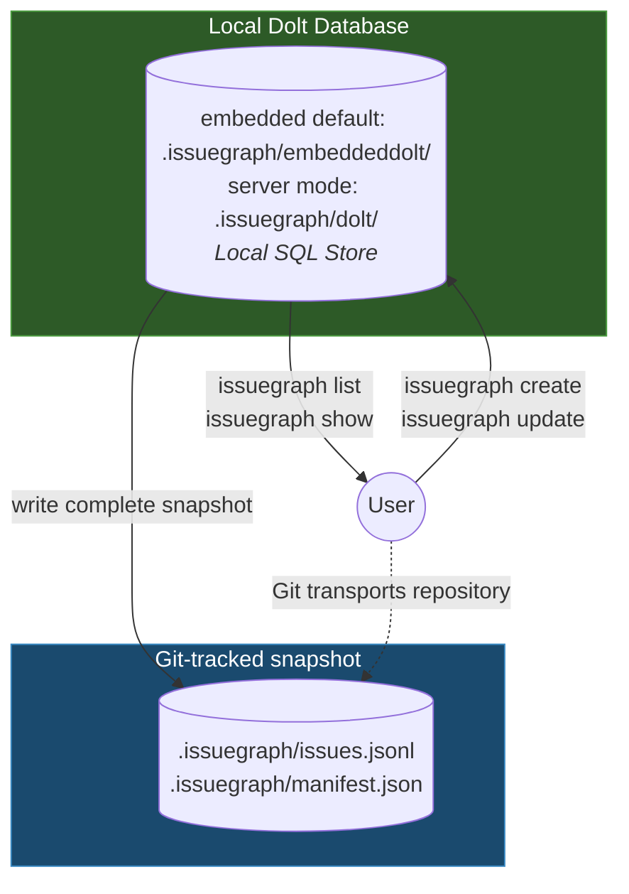

This document explains IssueGraph's local Dolt store, tracked snapshot, and data model. For the concept model — issues, dependencies, ready work, molecules — see [How IssueGraph Works](/core-concepts/index).

## Architecture

IssueGraph uses **Dolt** as its local storage backend -- a version-controlled SQL database. A complete JSONL snapshot and manifest under `.issuegraph/` are tracked by the user's Git repository.

By default, Dolt runs in **embedded mode** (in-process, no separate server). For multi-writer
setups (multiple agents, orchestrator), switch to **server mode** which connects to a
running `dolt sql-server`. See the [Dolt Server Mode](#dolt-server-mode) section below for details.



<Info>
**Source of Truth**
**Local Dolt** serves runtime reads and writes. The complete Git-tracked snapshot carries data between clones; Git controls repository transport.

Recovery uses `issuegraph snapshot restore` with both snapshot files, or restores a local filesystem backup with `issuegraph backup restore`.
</Info>

### Why Dolt?

- **Version-controlled SQL**: Full SQL queries with native version control
- **Local transactions**: Writes retain database atomicity and local history
- **Multi-writer**: Server mode supports concurrent agents
- **Tracked portability**: Git carries the complete snapshot between clones
- **Works offline**: All queries run against local database
- **Portable**: `issuegraph export` produces JSONL for migration and interoperability

## Data Model

The database stores five kinds of records: issues (the beads themselves), dependencies (typed edges such as `blocks`, `parent-child`, `related`, and `discovered-from`), labels, comments, and events (the audit trail). What each means — and how `issuegraph ready` computes the claimable frontier from them — is covered in [How IssueGraph Works](/core-concepts/index).

Issue IDs are content-derived hashes (`bd-a1b2`) so that concurrent writers never collide and no central ID coordination is needed. See [Hash-based IDs](/core-concepts/hash-ids) for the design and [COLLISION_MATH](https://github.com/gastownhall/beads/blob/main/engdocs/COLLISION_MATH.md) for the birthday-paradox analysis of hash length vs collision probability.

### Issue Schema

Core fields on every issue, as stored in Dolt and emitted in `issuegraph export` JSONL. Optional fields are omitted when empty.

| Field | Type | Description |
|-------|------|-------------|
| `id` | string | Unique hash ID (e.g., `bd-a1b2`) |
| `title` | string | Issue title (required) |
| `description` | string | Detailed description (optional) |
| `design` | string | Design notes (optional) |
| `acceptance_criteria` | string | Acceptance criteria (optional) |
| `notes` | string | Additional notes (optional) |
| `status` | string | `open`, `in_progress`, `blocked`, `deferred`, `closed`, `pinned`, `hooked` (defaults to `open`; extendable via the `status.custom` config key) |
| `priority` | int | 0–4, where 0 = critical and 4 = backlog |
| `issue_type` | string | `bug`, `feature`, `task`, `epic`, `chore`, `decision`, `message`, `molecule`, `gate`, `spike`, `story`, `milestone` (defaults to `task`) |
| `assignee` | string | Assigned user/agent (optional) |
| `estimated_minutes` | int | Time estimate in minutes (optional) |
| `created_at` / `updated_at` | RFC3339 | Creation and last-modification times |
| `created_by` | string | Who created the issue (optional) |
| `closed_at` / `close_reason` | RFC3339 / string | Set when the issue is closed (optional) |
| `external_ref` | string | External reference such as `gh-9` or `jira-ABC` (optional) |
| `metadata` | JSON | Arbitrary extension data — see [Issue Metadata](/core-concepts/metadata) |
| `labels` | []string | Tags attached to the issue (optional) |
| `dependencies` | []Dependency | Typed edges to other issues (optional) |
| `comments` | []Comment | Discussion thread (optional) |

Issues also carry workflow-layer field groups, among others: scheduling (`due_at`, `defer_until`), claim leasing (`lease_expires_at`, `heartbeat_at`), gates (`await_type`, `await_id`, `timeout`), and molecule/wisp fields (`ephemeral`, `mol_type`, `bonded_from`).

Internal fields — `content_hash` (a SHA-256 of the issue's canonical content, used for change detection), `source_repo`, and `id_prefix` — never appear in exports.

The schema is stable by default: prefer the `metadata` field for integration-, orchestrator-, or team-specific data before proposing new first-class fields. See the [Project Charter's schema boundary](https://github.com/gastownhall/beads/blob/main/engdocs/PROJECT_CHARTER.md#schema-boundary).

## Data Flow

### Write Path
```text
User runs issuegraph create
    → Dolt database updated
    → Auto-committed to Dolt history
```

### Read Path
```text
User runs issuegraph list
    → Dolt SQL query
    → Results returned immediately
```

### Portable Snapshot

IssueGraph keeps Dolt local. Each successful write updates a complete snapshot
under `.issuegraph/`; `issues.jsonl` stores records and `manifest.json` defines
the full set, including deletions. The user commits and transports these files
with ordinary Git. IssueGraph does not configure remotes, read or write
`refs/dolt/data`, or execute Git network commands. See [Sync Concepts](/core-concepts/sync-concepts).

Git reports text conflicts in the snapshot. Resolve the files, validate the
manifest, then restore the complete snapshot into the local database. Hash IDs
reduce collisions but do not merge conflicting edits to the same issue.

## Dolt Server Mode

The Dolt server handles local database operations:

- Manages the Dolt database backend
- Handles auto-commit for change tracking
- Provides concurrent access for multiple agents
- Runtime files live directly in `.beads/`: `dolt-server.pid`, `dolt-server.log`, and `dolt-server.port`

An opt-in *shared server* mode runs a single Dolt server at `~/.beads/shared-server/` for all projects, enabled with `dolt.shared-server: true` in `config.yaml` or `BEADS_DOLT_SHARED_SERVER=1` — see [Dolt Backend](/architecture/dolt#shared-server-mode).

<Tip>
Start the Dolt server with `issuegraph dolt start`. Check health with `issuegraph doctor`.
</Tip>

### Embedded Mode (No Server)

Embedded mode is the default (`issuegraph init` with no flags): Dolt runs in-process, single-writer, with data at `.beads/embeddeddolt/` — no server process and no separate Dolt install. Server mode is opt-in via `issuegraph init --server`; the choice is persisted in `.beads/metadata.json`.

```bash
issuegraph create "CI-generated issue"
```

**Beyond solo use, embedded mode is a natural fit for:**
- CI/CD pipelines (Jenkins, GitHub Actions)
- Docker containers
- Ephemeral environments
- Scripts that should not leave background processes

## Directory Layout

```text
.issuegraph/
├── embeddeddolt/     # Dolt database (embedded mode, default) — gitignored
├── dolt/             # Dolt database (server mode) — gitignored
├── dolt-server.pid   # Server-mode runtime files (.pid, .log, .port) — gitignored
├── issues.jsonl      # Complete issue snapshot — tracked by Git
├── manifest.json     # Full issue ID set; carries deletion semantics — tracked by Git
├── metadata.json     # Backend config — tracked in git
└── config.yaml       # Project config (optional) — tracked in git
```

The database directory is local runtime state; the JSONL and manifest are the
portable issue snapshot. The generated `.issuegraph/.gitignore` keeps database
and runtime files out of Git while allowing those two snapshot files to be
tracked. Existing `.beads/` workspaces remain readable during migration.

## Recovery Model

Dolt's local history and the Git-tracked snapshot provide separate recovery paths:

1. **Lost local database?** → Restore `.issuegraph/issues.jsonl` with its manifest using `issuegraph snapshot restore`
2. **Have a backup?** → Restore it: `issuegraph backup restore [path] --force`
3. **Snapshot merge conflict?** → Resolve the Git conflict, validate, then restore

Create backups at a local filesystem path with `issuegraph backup init`. Remote backup
destinations are not supported. Git transports the committed snapshot when the
user pushes the repository.

### Universal Recovery Sequence

The following sequence resolves the majority of reported issues. For detailed procedures, see [Recovery Runbooks](/recovery/index).

```bash
issuegraph dolt stop         # Stop local Dolt server
git pull --rebase            # User-managed repository update
issuegraph snapshot restore  # Restore validated snapshot to local Dolt
issuegraph dolt start        # Restart local server
```

<Warning>
**Use `issuegraph doctor --fix` With Care**
Always back up and preview before running `issuegraph doctor --fix`:

1. **Back up first:** `cp -r .issuegraph .issuegraph.backup`
2. **Preview changes:** `issuegraph doctor --dry-run` — shows what would be fixed without making changes
3. **Review diagnostics:** `issuegraph doctor` (no flags) — diagnostic only, no changes made
4. **Then fix:** `issuegraph doctor --fix` — or `issuegraph doctor --fix -i` to confirm each fix individually

**Why caution?** The `--fix` flag may remove dependencies it flags as circular, including valid parent-child relationships. Use `--fix-child-parent` only if you're certain the flagged deps are invalid.

**Other diagnostic tools:**
- `issuegraph blocked` — check which issues are blocked and why
- `issuegraph show <issue-id>` — inspect a specific issue's state
</Warning>

See [Recovery](/recovery/index) for specific procedures and [Database Corruption Recovery](/recovery/database-corruption) for Dolt recovery steps.

## Design Decisions

### Why Dolt?

Dolt is a version-controlled SQL database that provides git-like semantics natively. Unlike plain SQLite (binary merge conflicts) or JSONL (slow queries), Dolt gives you both fast SQL queries and proper merge semantics.

### Why not a cloud server?

IssueGraph is designed for offline-first, local-first development. The Dolt server runs locally -- no cloud dependency, no downtime, no vendor lock-in, and full functionality on airplanes or in restricted networks.

### Trade-offs

| Benefit | Trade-off |
|---------|-----------|
| Works offline | No real-time collaboration |
| Version-controlled database | Server mode needed for concurrent writers |
| Cell-level merge | Requires initial setup |
| Local-first speed | Manual sync to remotes |
| SQL queries | Dolt storage engine dependency |

### When NOT to use IssueGraph

IssueGraph is not suitable for:

- **Large teams (10+)** — Git-based sync doesn't scale well for high-frequency concurrent edits
- **Non-developers** — Requires Git and command-line familiarity
- **Real-time collaboration** — No live updates; requires explicit sync
- **Rich media attachments** — Designed for text-based issue tracking

For these use cases, consider GitHub Issues, Linear, or Jira.

## Related Documentation

- [How IssueGraph Works](/core-concepts/index) — The concept model: beads, dependencies, ready work, molecules
- [Sync Concepts](/core-concepts/sync-concepts) — Cross-machine sync, wire format, and anti-patterns
- [Dolt Backend](/architecture/dolt) — Embedded vs server mode in depth, shared server, migration
- [Recovery Runbooks](/recovery/index) — Step-by-step procedures for common issues
- [CLI Reference](/cli-reference/index) — Complete command documentation
- [Getting Started](/index) — Installation and first steps
- [Project Charter](https://github.com/gastownhall/beads/blob/main/engdocs/PROJECT_CHARTER.md) — Product scope and boundaries (contributor doc)
- [Internals](https://github.com/gastownhall/beads/blob/main/engdocs/INTERNALS.md) — Implementation details (contributor doc)
